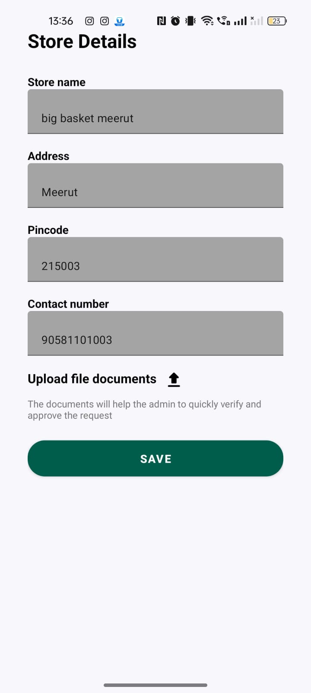

# 🌟 UdyamSakhi – Empowering Women Entrepreneurs via WhatsApp

**UdyamSakhi** is a WhatsApp-based vendor listing platform that empowers housewives and single mothers across India to start and scale their micro-businesses using the tool they are already familiar with — **WhatsApp**. The platform bridges the digital divide by offering a simple, accessible, and powerful system to list services, receive orders, process payments, and collaborate with other women entrepreneurs.

---

## 🏆 Built at HackMol 6.0

We developed UdyamSakhi in **36 hours** during **HackMol 6.0**, a national-level hackathon hosted at **NIT Jalandhar**, where we competed among the **top 70 teams from all over India**. Our aim was to create real-world social impact and offer scalable empowerment to women entrepreneurs.

---

## 📌 Problem Statement

Despite possessing skills like cooking, tailoring, beauty services, and tutoring, millions of housewives and single mothers in India face:

- 🚫 Lack of digital & technical skills  
- 📉 Limited market reach  
- ❌ No structured business management  
- 🧍‍♀️ Minimal community collaboration  

Existing platforms like Amazon, Shopify, or social media selling are too complex, expensive, or ineffective for their needs.

---

## 💡 Our Solution

**UdyamSakhi** offers:

✅ A simple WhatsApp-based vendor listing  
✅ Order and cart management via WhatsApp chats  
✅ Razorpay-integrated payment workflows  
✅ Collaboration and shared growth among women entrepreneurs  

---

## 🛠️ Features

- 📋 **Business Listing**: Women can list services like cooking, tailoring, etc., on WhatsApp.  
- 🛒 **Cart Management**: WhatsApp-based cart system with temporary state management.  
- 💳 **Payment Integration**: Razorpay-based dynamic payment links with webhook handling.  
- 🛍️ **Order Formatting**: Bulk order formatting for seller clarity (items, users, deadlines).  
- 🤝 **Community Building**: SHGs and women can collaborate digitally.  

---

## 🧑‍💻 Tech Stack

| Layer         | Technology                     |
|--------------|--------------------------------|
| Frontend     | Kotlin, Android (MVVM Pattern) |
| Backend      | Python, Flask                  |
| Database     | Firestore (Firebase)           |
| APIs         | Retrofit, OKHttp               |
| Tools        | Postman, Ngrok                 |
| Integrations | WhatsApp Business Cloud API, Razorpay |

---

## ⚙️ Architecture Overview

- Android app built using **MVVM** for scalable structure.  
- Backend built using **Flask** with Firestore integration.  
- API integration using **Retrofit** + **OKHttp**.  
- Webhooks handle payment confirmations via **Razorpay**.  
- WhatsApp Cloud API powers interactive chats with list replies and buttons.

---

## 📸 Screenshots / Demo

Here are some screenshots of the app:

- **Page 1**: 
- **Page 2**: 
- **Page 3**: 
- **Page 4**: 

**WhatsApp Screenshots**:

- **WSP 1**: 
- **WSP 2**: 
- **WSP 3**: 

---

## 🚀 How to Run Locally

### Prerequisites:

- Android Studio  
- Python 3.9+  
- Ngrok (for local API tunneling)  
- Firestore setup  
- Razorpay Developer Account  
- WhatsApp Business Cloud API access  

---

## 👨‍💻 Team UdyamSakhi

| Name                    | Role                   |
|-------------------------|------------------------|
| **Aryan Arya**          | Android App Developer  |
| **Aditya Gupta**        | Android App Developer  |
| **Sanket Suryawanshi**  | Backend Developer      |

---

## ❤️ Acknowledgements

Thanks to **HackMol 6.0** and **NIT Jalandhar** for providing us with this opportunity and platform to innovate for social good.
